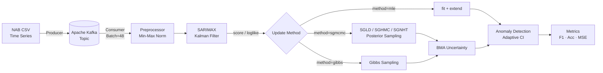

# SGMCMC-KF: Streaming Anomaly Detection via Stochastic Gradient MCMC with Kalman Filter

> Apache Kafka 기반 실시간 스트리밍 환경에서 **Stochastic Gradient MCMC**와 **Kalman Filter**를 결합해 SARIMAX 파라미터를 온라인으로 추론하고, 시계열 이상치를 탐지하는 베이지안 프레임워크입니다.

[](#-citation)
[](https://www.python.org/)
[](https://kafka.apache.org/)
[](LICENSE)

---

## 📖 Overview

본 레포지토리는 1저자 논문 **"SGMCMC-KF 알고리즘을 이용한 시계열 이상치 탐지"** (한국자료분석학회지, JKDAS, 2025) 의 공식 구현 코드입니다.

기존 MLE 기반 SARIMAX는 배치마다 전체 우도를 재적합해야 하므로 스트리밍 환경에서 비효율적이고, 사전분포 정보를 반영하기도 어렵습니다. 본 연구에서는 **Kalman Filter의 score function을 SGMCMC의 gradient로 직접 사용**하여, 매 배치마다 사전분포를 포함한 사후분포에서 SARIMAX 파라미터를 온라인으로 샘플링합니다.

### Key Contributions

- 🎯 **SGMCMC + Kalman Filter 통합** — Kalman Filter로 우도/기울기를 계산하고 SGLD·SGHMC·SGNHT로 사후분포 샘플링
- 🔄 **Streaming Pipeline** — Apache Kafka + Zookeeper로 배치 단위 온라인 학습 환경 구축
- 🧪 **7종 방법 통합 비교** — MLE / GD / SGD / SGLD / SGHMC / SGNHT / Gibbs Sampling 을 단일 파이프라인에서 비교
- 📈 **NAB 벤치마크 검증** — SGLD-KF가 F1 및 Precision 최우수 (100% Recall 유지)
- 🎲 **BMA 기반 불확실성** — 파라미터 사후분포 분산을 신뢰구간에 반영해 적응적 이상치 임계값 설정

---

## 🏗️ Architecture



**핵심 아이디어**: 칼만필터가 계산하는 ∂loglik/∂θ 를 SGMCMC의 ∇U(θ) 로 사용. 별도의 자동미분 없이 statsmodels의 `score()` 만으로 베이지안 추론이 가능합니다.

---

## 📁 Repository Structure

```
SGMCMC-KF/
├── README.md                  # 본 문서
├── requirements.txt           # Python 의존성
├── .gitignore
├── LICENSE
└── notebooks/
    └── SGMCMC_KF.ipynb        # 통합 노트북 (7가지 방법 비교 실험)
```

---

## 🚀 Quick Start

### 1. 환경 설정

```bash
git clone https://github.com/hjiyun/SGMCMC-KF.git
cd SGMCMC-KF

# 가상환경 권장
python -m venv venv
source venv/bin/activate          # Windows: venv\Scripts\activate

pip install -r requirements.txt
```

### 2. Apache Kafka 실행

별도 터미널에서 Zookeeper와 Kafka Broker를 실행합니다.

```bash
# Zookeeper
$KAFKA_HOME/bin/zookeeper-server-start.sh \
    $KAFKA_HOME/config/zookeeper.properties

# Kafka Broker
$KAFKA_HOME/bin/kafka-server-start.sh \
    $KAFKA_HOME/config/server.properties

# 토픽 생성
$KAFKA_HOME/bin/kafka-topics.sh --create \
    --topic sgmcmc-stream \
    --bootstrap-server localhost:9092 \
    --partitions 1 --replication-factor 1
```

### 3. 노트북 실행

```bash
jupyter notebook notebooks/SGMCMC_KF.ipynb
```

데이터는 NAB GitHub에서 자동으로 다운로드되므로 별도 준비가 필요 없습니다.

---

## 🧮 Methods

본 노트북은 다음 7가지 파라미터 추정 방법을 동일한 SARIMAX + Kalman Filter 파이프라인 위에서 통합 비교합니다.

| # | Method | Update Rule | Stochastic | Notes |
|:-:|:------:|:-----------:|:----------:|:------|
| 1 | **MLE** | `fit()` + `extend()` | ❌ | statsmodels 기반 베이스라인 |
| 2 | **GD** | θ ← θ − η ∇U(θ) | ❌ | 사전분포 포함 full-batch |
| 3 | **SGD** | θ ← θ − η ∇U(θ; mini-batch) | ✅ | 미니배치 stochastic gradient |
| 4 | **SGLD** | θ ← θ − η ∇U + √(2η)·N(0,I) | ✅ | Langevin Dynamics |
| 5 | **SGHMC** | momentum + friction | ✅ | Hamiltonian Monte Carlo |
| 6 | **SGNHT** | adaptive thermostat | ✅ | 자동 friction 보정 |
| 7 | **Gibbs** | 조건부 사후분포 샘플링 | ✅ | 파라미터 블록별 순차 업데이트 |

방법 선택은 `fit_model(..., method='sgld')` 처럼 인자로 전환합니다.

### Hyperparameters

```python
# 모델
ORDER          = (0, 1, 1)
SEASONAL_ORDER = (1, 1, 0, 12)     # 1시간 주기
BATCH_SIZE     = 48                # 배치당 샘플 수

# 베이지안 사전분포
PRIOR_MEAN = 0.0
PRIOR_VAR  = 10.0                  # weakly informative

# 최적화
LEARNING_RATE = 1e-5
GRAD_CLIP     = 1.0                # gradient explosion 방지
SIGMA_LEVEL   = 1.2                # 이상치 신뢰구간 배수
```

---

## 📊 Datasets

[NAB (Numenta Anomaly Benchmark)](https://github.com/numenta/NAB) 공개 데이터셋을 사용합니다.

| Dataset | 길이 | Anomalies | 비고 |
|---------|-----:|:---------:|:----|
| `realKnownCause/nyc_taxi.csv` | 10,320 | 5 | **본 연구 메인 실험 데이터** |
| `realKnownCause/machine_temperature_system_failure.csv` | 22,695 | 4 | 일반화 검증용 보조 데이터 |

데이터는 노트북 실행 시 NAB GitHub raw URL에서 자동 로드됩니다 (별도 다운로드 불필요).

데이터셋 변경은 노트북 상단 `DATASET` 변수에서 한 줄만 수정하시면 됩니다.

```python
DATASET = 'realKnownCause/nyc_taxi.csv'                              # 메인
# DATASET = 'realKnownCause/machine_temperature_system_failure.csv'  # 보조
```

> 📌 NYC Taxi 데이터는 10,320 시계열 포인트 중 라벨링된 이상치가 5개에 불과한 **극단적 클래스 불균형 벤치마크**입니다. 이 때문에 모든 방법의 절대 F1 값은 한 자릿수대로 측정되며, 본 연구의 평가는 *방법 간 상대 비교*에 초점을 둡니다.

---

## 🏆 Key Results

### Table 2. The Results of NYC Taxi Train Dataset

| Method   | Accuracy (%) | Precision (%) | Recall (%) | F1 (%)  | Time (s) |
|:---------|:------------:|:-------------:|:----------:|:-------:|:--------:|
| MLE      | 64.33        | 3.17          | 100        | 6.15    | 20.6     |
| Gibbs    | **81.29**    | 3.12          | 50         | 5.88    | 170.8    |
| GD       | 64.33        | 3.17          | 100        | 6.15    | 27.5     |
| SGD      | 65.50        | 3.28          | 100        | 6.35    | 34.0     |
| **SGLD** | 69.59        | **3.70**      | 100        | **7.14**| 31.0     |
| SGHMC    | 73.68        | 2.22          | 50         | 4.26    | 41.6     |
| SGNHT    | 66.67        | 3.39          | 100        | 6.56    | 41.0     |

### 핵심 관찰

**SGLD-KF는 F1 score(7.14%)와 Precision(3.70%) 모두에서 7가지 방법 중 최우수 성능**을 달성했으며, 동시에 100% Recall을 유지하여 가장 균형 잡힌 탐지 성능을 보였습니다. Langevin noise가 가져오는 mode exploration 효과로 비정상 패턴 변화에 빠르게 적응한 결과로 해석됩니다.

**Gibbs Sampling**은 가장 높은 Accuracy(81.29%)를 기록했으나, Recall이 50%로 떨어져 실제 이상치의 절반을 놓치는 trade-off를 보였습니다. 또한 학습 시간이 170.8초로 SGLD(31.0초) 대비 약 5.5배 길어, **스트리밍 환경에서는 SGLD-KF가 정확도-속도 trade-off에서 가장 실용적**입니다.

> 위 표는 논문 본문 Table 2를 그대로 옮긴 것입니다. NYC Taxi 데이터의 극단적 클래스 불균형(이상치 5/10,320) 으로 절대 F1 값은 낮으나, 본 평가는 동일 조건에서의 방법 간 상대 비교를 목적으로 합니다.

---

## 🛠️ Tech Stack

`Python 3.10` · `statsmodels` · `Apache Kafka` · `Zookeeper` · `kafka-python` · `numpy` · `pandas` · `scikit-learn` · `matplotlib` · `Jupyter`

---

## 📚 Citation

본 연구를 인용하실 때는 아래 BibTeX를 사용해 주시기 바랍니다.

```bibtex
@article{hong2025sgmcmckf,
  title   = {SGMCMC-KF 알고리즘을 이용한 시계열 이상치 탐지},
  author  = {홍지윤 and 전수영},
  journal = {Journal of the Korean Data Analysis Society (JKDAS)},
  year    = {2025},
  note    = {제1저자}
}
```

### Related Project

본 연구는 **한국연구재단 (NRF) 과제 RS-2024-00352792 — "베이지안 추론을 위한 Adaptively Weighted Stochastic Gradient MCMC 알고리즘"** 의 일환으로 수행되었습니다.

---

## 🔬 Author

**홍지윤 (Jiyun Hong)**
- 🎓 M.S. Student, Big Data Science, Korea University (Sejong Campus)
- 🏛️ Prof. Sooyoung Jeon's Lab
- 📧 [julie2302@naver.com](mailto:julie2302@naver.com)

### Research Interests
Bayesian Computation · SGMCMC · Streaming Anomaly Detection · Probabilistic Time Series · LLM/RAG

---

## 📄 License

MIT License — 자세한 내용은 [LICENSE](LICENSE) 파일을 참고해 주시기 바랍니다.

---

## 🙏 Acknowledgments

- [Numenta Anomaly Benchmark](https://github.com/numenta/NAB) for the open benchmark dataset
- statsmodels SARIMAX 구현
- 본 연구는 한국연구재단 (NRF, RS-2024-00352792) 과제의 지원을 받아 수행되었습니다.